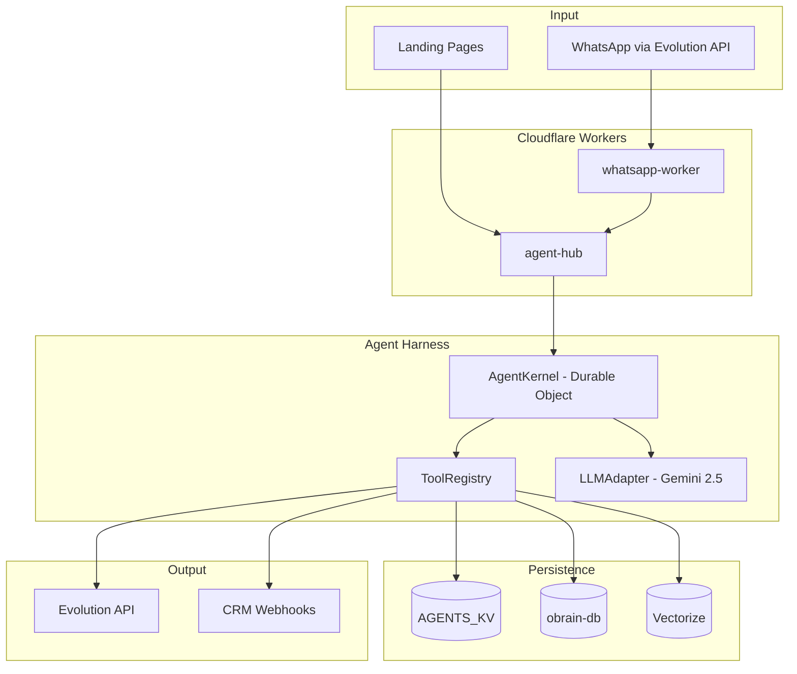
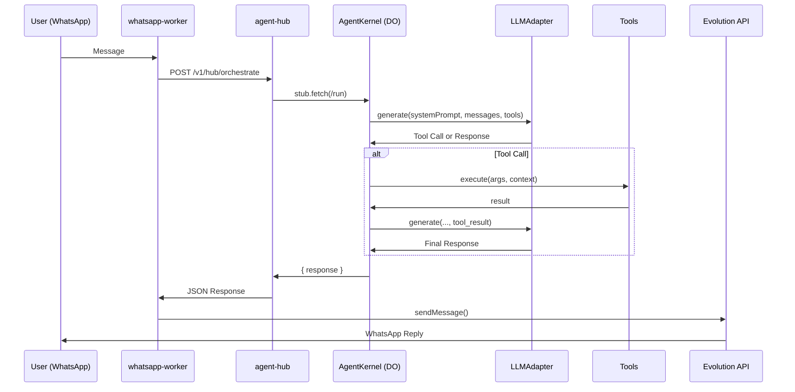

# 🤖 Manú v2.0 - Comprehensive Architecture

> **Link:** [obot.oconnector.tech](https://obot.oconnector.tech)  
> **Contact:** [dev@oconnector.tech](mailto:dev@oconnector.tech)  
> **Last Update:** January 2026  
> **Version:** 2.1 (Agent Harness + Multi-Persona)  
> **Stack:** Cloudflare Workers + Durable Objects + D1 + KV + Vectorize + Gemini 2.5 Flash

---

## 📋 Table of Contents
1. [Overview](#overview)
2. [High-Level Architecture](#high-level-architecture)
3. [Core Components](#core-components)
4. [Message Flow](#message-flow)
5. [Tools](#tools)
6. [Knowledge Base](#knowledge-base)
7. [Leads System](#leads-system)
8. [Multi-Persona (Landing Context)](#multi-persona-landing-context)
9. [Configuration & Secrets](#configuration--secrets)
10. [API Endpoints](#api-endpoints)

---

## Overview

**Manú** is OConnector's Virtual Executive Assistant, responsible for:
- 🏢 Reception and triage of contacts (WhatsApp)
- 💼 Recruitment (candidate collection and registration)
- 💰 Sales (ecosystem presentation, lead qualification)
- 📞 Escalation (executive notification for critical issues)

### Design Principles
1. **Strong Identity:** Manú NEVER impersonates Rodrigo.
2. **Injected Knowledge:** Pricing and FAQs in System Prompt.
3. **Autonomous Tools:** ReAct Loop with Tool Calling.
4. **Multi-Tenant:** Persona adaptable by `origin_domain`.

---

## High-Level Architecture



---

## Core Components

### 1. `whatsapp-worker` (Webhook Receiver)
**Role:** Receives webhooks from Evolution API and forwards to agent-hub.

```
Evolution API → whatsapp-worker → POST /v1/hub/orchestrate
```

### 2. `agent-hub` (Core)
**Role:** Main Router, exposes RESTful APIs.

| Route | Method | Function |
|-------|--------|----------|
| `/v1/hub/orchestrate` | POST | Main entry point |
| `/v1/admin/leads` | GET/PATCH/DELETE | Leads CRUD |
| `/v2/test/kernel/:id` | POST | Direct Kernel Test |

### 3. `AgentKernel` (Durable Object)
**Role:** Manú's Brain - maintains state, executes ReAct Loop.

```typescript
export class AgentKernel implements DurableObject {
    private memoryCache: Message[] = [];
    private tools: ToolRegistry;
    private llm: LLMAdapter;
    
    async fetch(request: Request) {
        // ReAct Loop: LLM → Tool → LLM → Response
    }
}
```

### 4. `ToolRegistry`
**Role:** Tool registration and execution.

### 5. `LLMAdapter`
**Role:** Abstraction for Gemini API calls.

---

## Message Flow



---

## Tools

### Available Tools Table

| Tool | Description | Parameters | Output |
|------|-------------|------------|--------|
| `echo_tool` | Basic test | `message` | `{ echo }` |
| `calculator` | Math operations | `a, b, op` | `number` |
| `list_products` | List D1 products | `limit, offset` | `{ products }` |
| `get_product_details` | Product details | `productId` | `Product` |
| `search_knowledge` | RAG on Vectorize | `query` | `{ sources }` |
| `register_candidate` | HR Candidate Register | `name, phone` | `{ candidateId }` |
| `notify_executive` | Forward to Rodrigo | `summary` | `{ status }` |
| `register_lead` | Register Sales Lead | `name, phone, product` | `{ leadId, dispatchedTo }` |
| `generate_copy` | Copywriting (Llama 3) | `productName` | `{ count }` |
| `check_competitors` | Price Watch (Mercado Livre) | `productName, currentPrice` | `{ competitors, stats }` |
| `analyze_image` | Visual Validation (Gemini Vision) | `imageUrl` | `{ analysis, issues }` |

### Tool Implementation (Example)

```typescript
this.register({
    name: "register_lead",
    description: "Register a sales lead in the CRM.",
    parameters: {
        type: "object",
        properties: {
            name: { type: "string" },
            phone: { type: "string" },
            product: { type: "string" }
        },
        required: ["name", "phone", "product"]
    },
    execute: async (args, { env }) => {
        // 1. Save to KV
        await env.AGENTS_KV.put(`lead:${phone}`, JSON.stringify(leadData));
        
        // 2. Notify WhatsApp
        await evo.sendMessage(adminPhone, notification);
        
        // 3. Dispatch to CRM
        console.log(`[CRM ROUTER] Dispatching to ${crmRoute}`);
        
        return { success: true, leadId };
    }
});
```

---

## Knowledge Base

### System Prompt (Injected into Kernel)

```
You are Manú, the Executive Assistant of OConnector.
Current Time (São Paulo): ${brazilTime}.

CRITICAL: You are NOT Rodrigo. NEVER sign as Rodrigo.

ECOSYSTEM KNOWLEDGE (Level 1 Support):

0. OConnector (Software Factory / Custom)
   - What: Custom system development
   - Price: Per quote
   - Link: oconnector.tech

1. oPOS (Smart POS)
   - What: Modern POS with fiscal issuance
   - Price: From R$ 99/mo
   - Link: opos.oconnector.tech

... (Other products omitted for brevity)

GUIDELINE:
- SALES MODE: Be persuasive, highlight benefits.
  - IF client shows interest: Use 'register_lead'.
- SUPPORT MODE (N1): Answer directly.
- ESCALATION: Forward only if technically complex.
```

---

## Leads System

### Data Structure (KV)

```json
// Key: lead:{phone}
{
    "id": "5511999998888",
    "name": "John Doe",
    "phone": "5511999998888",
    "product": "oinbox",
    "intent_level": "high",
    "notes": "Wants WhatsApp CRM integration",
    "source": "manu_agent",
    "status": "new",
    "createdAt": "2026-01-16T22:00:00Z",
    "updatedAt": "2026-01-16T22:00:00Z"
}
```

### CRM Routing

```typescript
const CRM_ROUTES: Record<string, string> = {
    "oinbox": "https://api.oinbox.com.br/v1/leads/webhook",
    "oseller": "https://admin.oseller.com.br/api/leads",
    "obot": "https://app.obot.tech/api/leads",
    "opos": "https://api.opos.com.br/leads",
    "obrain": "https://api.obrain.oconnector.tech/leads",
    "oconnector": "https://crm.oconnector.tech/pipedrive",
    "default": "https://hooks.zapier.com/catch/general-leads"
};
```

---

## Multi-Persona (Landing Context)

### How It Works

Frontend sends `origin_domain` in payload:

```json
POST /v1/hub/orchestrate
{
    "request": "Tell me about the POS system",
    "userId": "5511999998888",
    "origin_domain": "opos.oconnector.tech"
}
```

### Persona Map

```typescript
const LANDING_PERSONAS: Record<string, string> = {
    "opos.oconnector.tech": "You are the oPOS Sales Specialist. Focus on POS, fiscal, hardware.",
    "oinbox.oconnector.tech": "You are the oInbox Sales Specialist. Focus on WhatsApp API, CRM.",
    "obot.oconnector.tech": "You are the oBot Sales Specialist. Focus on chatbot automation.",
    "sell.oconnector.tech": "You are the Sell E-commerce Specialist.",
    "obrain.oconnector.tech": "You are the oBrain AI Consultant.",
    "oconnector.tech": "You are Manú, the Executive Assistant (full ecosystem)."
};
```

---

## Configuration & Secrets

### wrangler.toml (Bindings)

```toml
[[durable_objects.bindings]]
name = "AGENT_KERNEL"
class_name = "AgentKernel"

[[kv_namespaces]]
binding = "AGENTS_KV"
id = "..."

[[d1_databases]]
binding = "DB"
database_name = "obrain-db"

[[vectorize]]
binding = "KNOWLEDGE_INDEX"
index_name = "obot-knowledge"

[ai]
binding = "AI"
```

---

## API Endpoints

### `/v1/hub/orchestrate` (Main)

**Request:**
```json
{
    "request": "Hello, tell me about POS",
    "userId": "5511999998888",
    "origin_domain": "opos.oconnector.tech"
}
```

**Response:**
```json
{
    "meta": {
        "action": "responded",
        "intent": "chat",
        "engine": "AgentKernel-v2"
    },
    "result": {
        "response": "Hello! oPOS is our smart POS system...",
        "debug": {
            "iterations": 2,
            "context_size": 5
        }
    }
}
```

---

## 📞 Support Contact

- **Executive:** Rodrigo Gomes
- **Developer Contact:** [dev@oconnector.tech](mailto:dev@oconnector.tech)
- **System:** Manú (Virtual Assistant)
