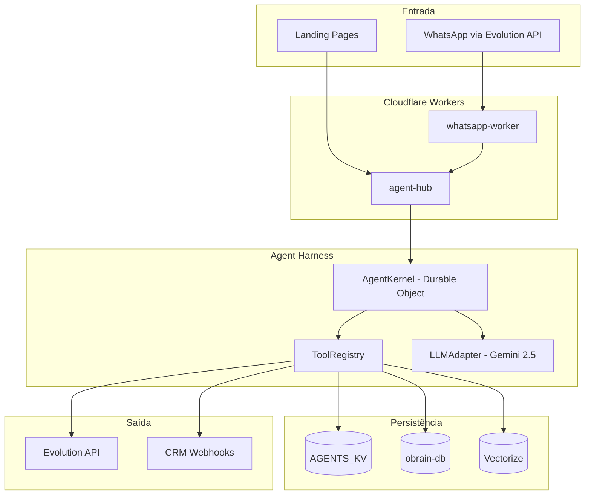
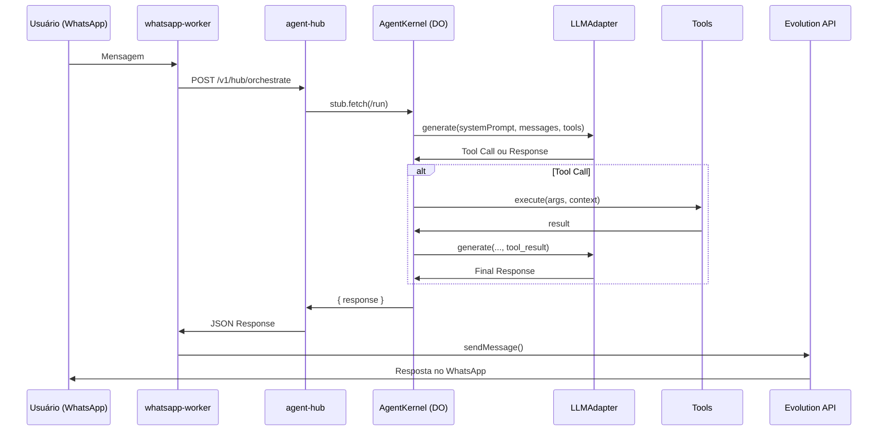

# 🤖 Manú v2.0 - Arquitetura Completa

> **Última Atualização:** Janeiro 2026  
> **Versão:** 2.0 (Agent Harness + Multi-Persona)  
> **Stack:** Cloudflare Workers + Durable Objects + D1 + KV + Vectorize + Gemini 2.5 Flash

---

## 📋 Índice
1. [Visão Geral](#visão-geral)
2. [Arquitetura de Alto Nível](#arquitetura-de-alto-nível)
3. [Componentes Principais](#componentes-principais)
4. [Fluxo de Mensagens](#fluxo-de-mensagens)
5. [Ferramentas (Tools)](#ferramentas-tools)
6. [Base de Conhecimento](#base-de-conhecimento)
7. [Sistema de Leads](#sistema-de-leads)
8. [Multi-Persona (Landing Context)](#multi-persona-landing-context)
9. [Configuração e Secrets](#configuração-e-secrets)
10. [Endpoints da API](#endpoints-da-api)

---

## Visão Geral

**Manú** é a Assistente Executiva Virtual da OConnector, responsável por:
- 🏢 Recepção e triagem de contatos (WhatsApp)
- 💼 Recrutamento (coleta e registro de candidatos)
- 💰 Vendas (apresentação do ecossistema, qualificação de leads)
- 📞 Encaminhamento (notificação ao executivo para assuntos críticos)

### Princípios de Design
1. **Identidade Forte:** Manú NUNCA se passa por Rodrigo
2. **Conhecimento Injetado:** Preços e FAQs no System Prompt
3. **Ferramentas Autônomas:** ReAct Loop com Tool Calling
4. **Multi-Tenant:** Persona adaptável por `origin_domain`

---

## Arquitetura de Alto Nível



---

## Componentes Principais

### 1. `whatsapp-worker` (Webhook Receiver)
**Arquivo:** Projeto separado  
**Função:** Recebe webhooks da Evolution API e repassa para o agent-hub

```
Evolution API → whatsapp-worker → POST /v1/hub/orchestrate
```

### 2. `agent-hub` (Core)
**Arquivo:** `src/index.ts`  
**Função:** Router principal, expõe APIs RESTful

| Rota | Método | Função |
|------|--------|--------|
| `/v1/hub/orchestrate` | POST | Entry point principal |
| `/v1/admin/leads` | GET/PATCH/DELETE | CRUD de leads |
| `/v2/test/kernel/:id` | POST | Teste direto do Kernel |

### 3. `AgentKernel` (Durable Object)
**Arquivo:** `src/harness/kernel.ts`  
**Função:** Cérebro da Manú - mantém estado, executa ReAct Loop

```typescript
export class AgentKernel implements DurableObject {
    private memoryCache: Message[] = [];
    private tools: ToolRegistry;
    private llm: LLMAdapter;
    
    async fetch(request: Request) {
        // ReAct Loop: LLM → Tool → LLM → Response
    }
}
```

### 4. `ToolRegistry`
**Arquivo:** `src/harness/tools.ts`  
**Função:** Registro e execução de ferramentas

### 5. `LLMAdapter`
**Arquivo:** `src/harness/adapter.ts`  
**Função:** Abstração para chamadas ao Gemini API

---

## Fluxo de Mensagens



---

## Ferramentas (Tools)

### Tabela de Ferramentas Disponíveis

| Tool | Descrição | Parâmetros | Saída |
|------|-----------|------------|-------|
| `echo_tool` | Teste básico | `message` | `{ echo }` |
| `calculator` | Operações math | `a, b, op` | `number` |
| `list_products` | Lista produtos D1 | `limit, offset` | `{ products }` |
| `get_product_details` | Detalhes de produto | `productId` | `Product` |
| `search_knowledge` | RAG no Vectorize | `query` | `{ sources }` |
| `register_candidate` | Registra candidato RH | `name, phone` | `{ candidateId }` |
| `notify_executive` | Encaminha ao Rodrigo | `summary` | `{ status }` |
| `register_lead` | Registra lead de vendas | `name, phone, product` | `{ leadId, dispatchedTo }` |
| `generate_copy` | Gera Copywriting (Llama 3) | `productName` | `{ count }` |
| `check_competitors` | Price Watch (Mercado Livre) | `productName, currentPrice` | `{ competitors, stats }` |
| `analyze_image` | Validação Visual (Gemini Vision) | `imageUrl` | `{ analysis, issues }` |

### Implementação de Tool (Exemplo)

```typescript
this.register({
    name: "register_lead",
    description: "Register a sales lead in the CRM.",
    parameters: {
        type: "object",
        properties: {
            name: { type: "string" },
            phone: { type: "string" },
            product: { type: "string" }
        },
        required: ["name", "phone", "product"]
    },
    execute: async (args, { env }) => {
        // 1. Salvar no KV
        await env.AGENTS_KV.put(`lead:${phone}`, JSON.stringify(leadData));
        
        // 2. Notificar WhatsApp
        await evo.sendMessage(adminPhone, notification);
        
        // 3. Dispatch para CRM
        console.log(`[CRM ROUTER] Dispatching to ${crmRoute}`);
        
        return { success: true, leadId };
    }
});
```

---

## Base de Conhecimento

### System Prompt (Injetado no Kernel)

```
You are Manú, the Executive Assistant of OConnector.
Current Time (São Paulo): ${brazilTime}.

CRITICAL: You are NOT Rodrigo. NEVER sign as Rodrigo.

ECOSYSTEM KNOWLEDGE (Level 1 Support):

0. OConnector (Fábrica de Software / Custom)
   - O que é: Desenvolvimento de sistemas sob medida
   - Preço: Sob orçamento
   - Link: oconnector.tech

1. oPOS (Frente de Caixa Inteligente)
   - O que é: PDV moderno com emissão fiscal
   - Preço: A partir de R$ 99/mês
   - Link: opos.oconnector.tech

2. oInbox (Atendimento Omnichannel)
   - O que é: Centralize WhatsApp, Insta e Face
   - Preço: R$ 197/mês (3 usuários)
   - Link: oinbox.oconnector.tech

3. oBot (Automação de Conversas)
   - O que é: Construtor visual de fluxos
   - Preço: R$ 149/mês
   - Link: o-bot.app

4. Sell (E-commerce Plug & Play)
   - O que é: Loja virtual pronta em minutos
   - Preço: R$ 89/mês + 1% taxa
   - Link: sell.oconnector.tech

5. oBrain (Inteligência Artificial)
   - O que é: Consultoria de Dados e IA
   - Preço: Sob consulta (Enterprise)
   - Link: obrain.oconnector.tech

GUIDELINE:
- MODO VENDEDORA: Seja persuasiva, destaque benefícios.
  - SE o cliente mostrar interesse: Use 'register_lead'.
- MODO SUPORTE (N1): Tire dúvidas diretamente.
- ESCALONAMENTO: Encaminhe apenas se for técnico complexo.
```

---

## Sistema de Leads

### Estrutura de Dados (KV)

```json
// Chave: lead:{phone}
{
    "id": "5511999998888",
    "name": "João Silva",
    "phone": "5511999998888",
    "product": "oinbox",
    "intent_level": "high",
    "notes": "Quer integrar WhatsApp com CRM",
    "source": "manu_agent",
    "status": "new",
    "createdAt": "2026-01-16T22:00:00Z",
    "updatedAt": "2026-01-16T22:00:00Z"
}
```

### CRM Routing

```typescript
const CRM_ROUTES: Record<string, string> = {
    "oinbox": "https://api.oinbox.com.br/v1/leads/webhook",
    "oseller": "https://admin.oseller.com.br/api/leads",
    "obot": "https://app.obot.tech/api/leads",
    "opos": "https://api.opos.com.br/leads",
    "obrain": "https://api.obrain.oconnector.tech/leads",
    "oconnector": "https://crm.oconnector.tech/pipedrive",
    "default": "https://hooks.zapier.com/catch/general-leads"
};
```

### Painel de Visualização
- **URL:** `https://o-bot.app/leads`
- **API:** `GET /v1/admin/leads`

---

## Multi-Persona (Landing Context)

### Como Funciona

O frontend envia `origin_domain` no payload:

```json
POST /v1/hub/orchestrate
{
    "request": "Quero saber sobre o sistema de caixa",
    "userId": "5511999998888",
    "origin_domain": "opos.oconnector.tech"
}
```

### Mapa de Personas

```typescript
const LANDING_PERSONAS: Record<string, string> = {
    "opos.oconnector.tech": "You are the oPOS Sales Specialist. Focus on PDV, fiscal, hardware.",
    "o-bot.app": "You are the oBot Sales Specialist. Focus on chatbot automation.",
    "sell.oconnector.tech": "You are the Sell E-commerce Specialist.",
    "oinbox.oconnector.tech": "You are the oInbox Omnichannel Specialist.",
    "obrain.oconnector.tech": "You are the oBrain AI Consultant.",
    "salveplate.oconnector.tech": "You are the SalvePlate Sustainability Specialist.",
    "tecnopubli.pt": "You are the TecnoPubli Marketing Specialist.",
    "oconnector.tech": "You are Manú, the Executive Assistant (full ecosystem)."
};
```

---

## Configuração e Secrets

### wrangler.toml (Bindings)

```toml
[[durable_objects.bindings]]
name = "AGENT_KERNEL"
class_name = "AgentKernel"

[[kv_namespaces]]
binding = "AGENTS_KV"
id = "de32426dc5d94fbfbb4694fb6ab69a40"

[[d1_databases]]
binding = "DB"
database_name = "obrain-db"
database_id = "e4df050c-8d5c-4941-b93d-ea21b8b5a60f"

[[vectorize]]
binding = "KNOWLEDGE_INDEX"
index_name = "obot-knowledge"

[ai]
binding = "AI"
```

### Variáveis de Ambiente (.env)

```env
GEMINI_API_KEY_1=AIza...
GEMINI_API_KEY_2=AIza...
GEMINI_API_KEY_3=AIza...
EVOLUTION_BASE_URL=https://evo.example.com
EVOLUTION_API_KEY=...
EVOLUTION_INSTANCE=oconnector
ADMIN_PHONE=17813195478
```

---

## Endpoints da API

### `/v1/hub/orchestrate` (Principal)

**Request:**
```json
{
    "request": "Olá, quero saber sobre o sistema de PDV",
    "userId": "5511999998888",
    "origin_domain": "opos.oconnector.tech"
}
```

**Response:**
```json
{
    "meta": {
        "action": "responded",
        "intent": "chat",
        "engine": "AgentKernel-v2"
    },
    "result": {
        "response": "Olá! O oPOS é nosso sistema de frente de caixa...",
        "debug": {
            "iterations": 2,
            "context_size": 5
        }
    }
}
```

### `/v1/admin/leads` (CRUD)

| Método | Função |
|--------|--------|
| GET | Lista todos os leads |
| PATCH | Atualiza status de um lead |
| DELETE | Remove um lead |

---

## 📁 Arquivos-Chave

| Arquivo | Função |
|---------|--------|
| `src/index.ts` | Entry point, router |
| `src/harness/kernel.ts` | AgentKernel (Durable Object) |
| `src/harness/tools.ts` | ToolRegistry |
| `src/harness/adapter.ts` | LLMAdapter (Gemini) |
| `src/routes/hub-routes.ts` | Rotas /v1/hub/* |
| `src/routes/admin.ts` | Rotas /v1/admin/* |
| `src/services/evolution.ts` | EvolutionService (WhatsApp) |
| `src/db/schema.ts` | Schema Drizzle (D1) |

---

## 🔄 Ciclo de Vida de uma Mensagem

1. **Entrada:** WhatsApp → Evolution API → whatsapp-worker
2. **Orquestração:** POST `/v1/hub/orchestrate` → agent-hub
3. **Processamento:** AgentKernel (DO) recebe via `/run`
4. **Raciocínio:** LLMAdapter → Gemini 2.5 Flash (ReAct Loop)
5. **Ação:** ToolRegistry executa tools conforme necessário
6. **Resposta:** Kernel retorna → agent-hub → whatsapp-worker
7. **Saída:** Evolution API → WhatsApp do usuário

---

## 🚀 Deploy

```bash
cd /Volumes/LexarAPFS/HUB-agents/agent-hub
npm run deploy
```

---

## 📞 Contato de Suporte

- **Executivo:** Rodrigo Gomes
- **WhatsApp Interno:** +1 781 319 5478
- **Sistema:** Manú (Assistente Virtual)

---

> **Nota:** Este documento deve ser atualizado sempre que houver mudanças significativas na arquitetura da Manú.
